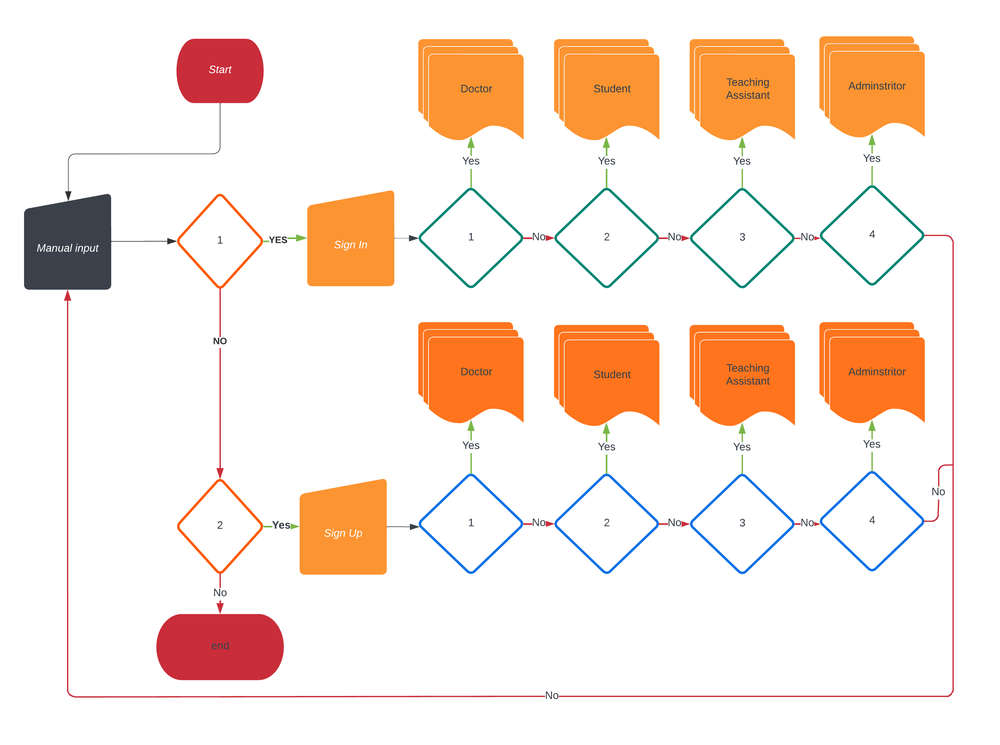
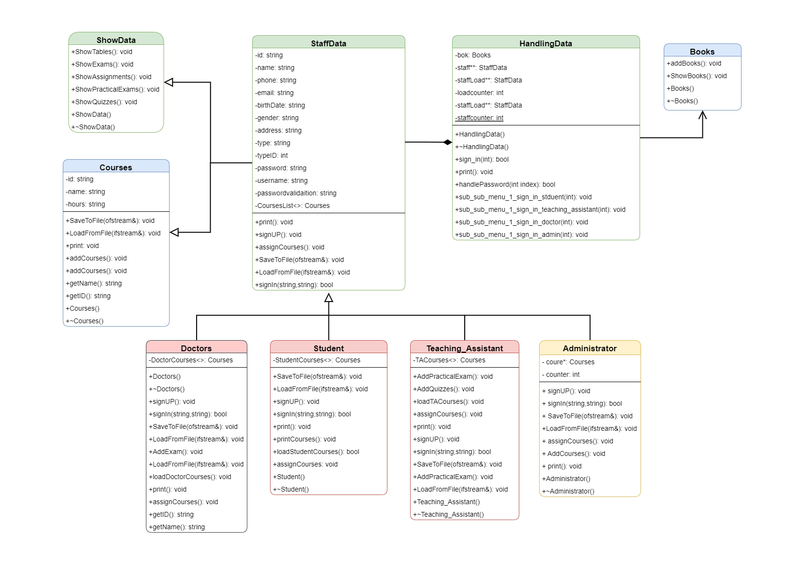

# 🎓 College System

The **College System** is a simple software application designed to manage essential college data such as **courses, staff, students, teaching assistants, and administrators**.  
It uses **files as a temporary database** to store, retrieve, and manage information.  

---

## ✨ Goals of the Project
- Build a **basic data management system** for a college.  
- Implement **role-based access** (Doctor, Student, TA, Administrator).  
- Use **file handling** as a lightweight database solution.  
- Demonstrate **OOP concepts** with UML-based design.  

---

## 🚀 Features
- 🔑 **Authentication** – Sign Up and Sign In for different roles.  
- 👨‍🏫 **Role-Based Access** – Doctor, Student, Teaching Assistant, Administrator.  
- 📚 **Course Management** – Add, assign, and manage courses.  
- 📝 **Exam & Assignment Handling** – Students and TAs can access and manage tasks.  
- 💾 **File-Based Database** – Data stored in files for persistence and retrieval.  

---

## 🛠️ Tech Stack
- **Language:** C++  
- **Concepts:** OOP (Inheritance, Polymorphism), File Handling  
- **Design:** UML diagrams, Flowcharts  

---

## 📊 Flow Chart


---

## 🏗️ UML Diagram


---

## ⚡ How to Run
1. Clone the repository:  
   ```bash
   git clone https://github.com/AndDevil/College-System.git
   cd College-System```

2. Compile the C++ files:

```g++ main.cpp -o college-system```


3. Run the program:

```./college-system```


---

## 🤝 Contributions

Contributions are welcome!
If you’d like to improve the project (e.g., database integration or UI), feel free to fork this repository and submit a pull request.


---

## 📄 License

This project is licensed under the MIT License – see the LICENSE file for details.


---

## 👨‍💻 Author
**Shrish Kumar**  
- GitHub: [AndDevil](https://github.com/AndDevil)  
- LinkedIn: [Shrish Kumar](https://www.linkedin.com/in/shrish-k-83821212a/)
